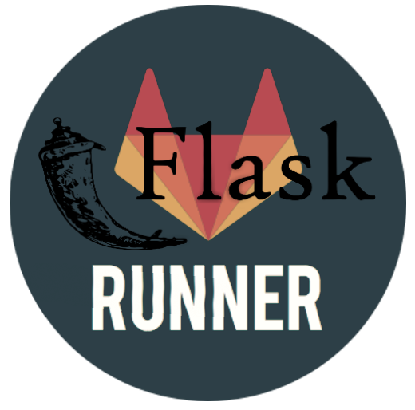
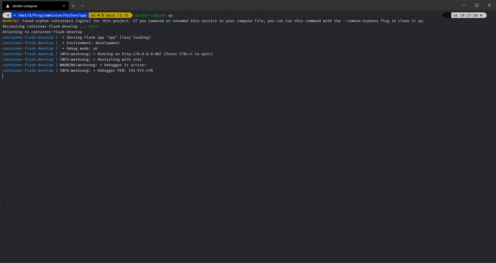

<!--
*** Thanks for checking out the Best-README-Template. If you have a suggestion
*** that would make this better, please fork the repo and create a pull request
*** or simply open an issue with the tag "enhancement".
*** Thanks again! Now go create something AMAZING! :D
***
***
***
*** To avoid retyping too much info. Do a search and replace for the following:
*** XaniXxable, Flask_testcases_visualation, twitter_handle, xanixxable@gmail.com, Gitrunner Web visualizer, project_description
-->


<!-- PROJECT SHIELDS -->
<!--
*** I'm using markdown "reference style" links for readability.
*** Reference links are enclosed in brackets [ ] instead of parentheses ( ).
*** See the bottom of this document for the declaration of the reference variables
*** for contributors-url, forks-url, etc. This is an optional, concise syntax you may use.
*** https://www.markdownguide.org/basic-syntax/#reference-style-links
-->
[![Contributors][contributors-shield]][contributors-url]
[![Forks][forks-shield]][forks-url]
[![Stargazers][stars-shield]][stars-url]
[![Issues][issues-shield]][issues-url]
[![MIT License][license-shield]][license-url]
<!-- [![LinkedIn][linkedin-shield]][linkedin-url] -->


<!-- PROJECT LOGO -->
<br />
<p align="center">
  <a href="https://github.com/xanixxable/Flask_testcases_visualation">
    
  </a>

  <h3 align="center">Gitrunner Web visualizer</h3>

  <p align="center">
    project_description
    <br />
    <a href="https://github.com/xanixxable/Flask_testcases_visualation"><strong>Explore the docs »</strong></a>
    <br />
    <br />
    <a href="https://github.com/xanixxable/Flask_testcases_visualation">View Demo</a>
    ·
    <a href="https://github.com/xanixxable/Flask_testcases_visualation/issues">Report Bug</a>
    ·
    <a href="https://github.com/xanixxable/Flask_testcases_visualation/issues">Request Feature</a>
  </p>
</p>


<!-- TABLE OF CONTENTS -->
<details open="open">
  <summary><h2 style="display: inline-block">Table of Contents</h2></summary>
  <ol>
    <li>
      <a href="#about-the-project">About The Project</a>
      <ul>
        <li><a href="#built-with">Built With</a></li>
      </ul>
    </li>
    <li>
      <a href="#getting-started">Getting Started</a>
      <ul>
        <li><a href="#prerequisites">Prerequisites</a></li>
        <li><a href="#installation">Installation</a></li>
      </ul>
    </li>
    <li><a href="#usage">Usage</a></li>
    <!-- <li><a href="#roadmap">Roadmap</a></li> -->
    <li><a href="#contributing">Contributing</a></li>
    <li><a href="#license">License</a></li>
    <li><a href="#contact">Contact</a></li>
    <li><a href="#acknowledgements">Acknowledgements</a></li>
  </ol>
</details>


<!-- ABOUT THE PROJECT -->
## About The Project

<!-- [![Product Name Screen Shot][product-screenshot]](https://example.com) -->
This is a project for a dockerized Gitrunner and Flask server. Both on them works independent.


<!-- Here's a blank template to get started: -->
<!-- **To avoid retyping too much info. Do a search and replace with your text editor for the following:** -->
<!-- `project_description` -->


### Built With

* [Docker](https://www.docker.com/)
* [Git Runner](https://docs.gitlab.com/runner/)
* [Flask](https://flask.palletsprojects.com/en/1.1.x/)


<!-- GETTING STARTED -->
## Getting Started

To get a local copy up and running follow these simple steps.

### Prerequisites

In order to use this project, you have to download and install Docker.

* [For Windows](https://docs.docker.com/docker-for-windows/install/)
* [For Ubuntu](https://docs.docker.com/engine/install/ubuntu/)
* [For Mac](https://docs.docker.com/docker-for-mac/install/)

### Installation

1. Clone the repo
   ```sh
   git clone https://github.com/XaniXxable/Flask_testcases_visualation.git
   ```
2. Build docker image
   ```sh
   docker-compose build
   ```


<!-- USAGE EXAMPLES -->
## Usage

Start the docker image
```sh
docker-compose up
```
after that you should see something like this


Now you should be able to see a little start page at [localhost](http://localhost).

<!-- ROADMAP
## Roadmap

See the [open issues](https://github.com/XaniXxable/Flask_testcases_visualation/issues) for a list of proposed features (and known issues).
 -->


<!-- CONTRIBUTING -->
## Contributing

Contributions are what make the open source community such an amazing place to be learn, inspire, and create. Any contributions you make are **greatly appreciated**.

1. Fork the Project
2. Create your Feature Branch (`git checkout -b feature/AmazingFeature`)
3. Commit your Changes (`git commit -m 'Add some AmazingFeature'`)
4. Push to the Branch (`git push origin feature/AmazingFeature`)
5. Open a Pull Request


<!-- LICENSE -->
## License

Distributed under the MIT License. See `LICENSE` for more information.


<!-- CONTACT -->
## Contact

Matthias Hemmer - [@twitter_handle](https://twitter.com/twitter_handle) - xanixxable@gmail.com

Project Link: [https://github.com/XaniXxable/Flask_testcases_visualation](https://github.com/XaniXxable/Flask_testcases_visualation)


<!-- ACKNOWLEDGEMENTS -->
## Acknowledgements

* [Best-README-Template](https://github.com/othneildrew/Best-README-Template)


<!-- MARKDOWN LINKS & IMAGES -->
<!-- https://www.markdownguide.org/basic-syntax/#reference-style-links -->
[contributors-shield]: https://img.shields.io/github/contributors/XaniXxable/repo.svg?style=for-the-badge
[contributors-url]: https://github.com/XaniXxable/repo/graphs/contributors
[forks-shield]: https://img.shields.io/github/forks/XaniXxable/repo.svg?style=for-the-badge
[forks-url]: https://github.com/XaniXxable/repo/network/members
[stars-shield]: https://img.shields.io/github/stars/XaniXxable/repo.svg?style=for-the-badge
[stars-url]: https://github.com/XaniXxable/repo/stargazers
[issues-shield]: https://img.shields.io/github/issues/XaniXxable/repo.svg?style=for-the-badge
[issues-url]: https://github.com/XaniXxable/repo/issues
[license-shield]: https://img.shields.io/github/license/XaniXxable/repo.svg?style=for-the-badge
[license-url]: https://github.com/XaniXxable/repo/blob/master/LICENSE.txt
<!-- [linkedin-shield]: https://img.shields.io/badge/-LinkedIn-black.svg?style=for-the-badge&logo=linkedin&colorB=555 -->
<!-- [linkedin-url]: https://linkedin.com/in/XaniXxable -->
